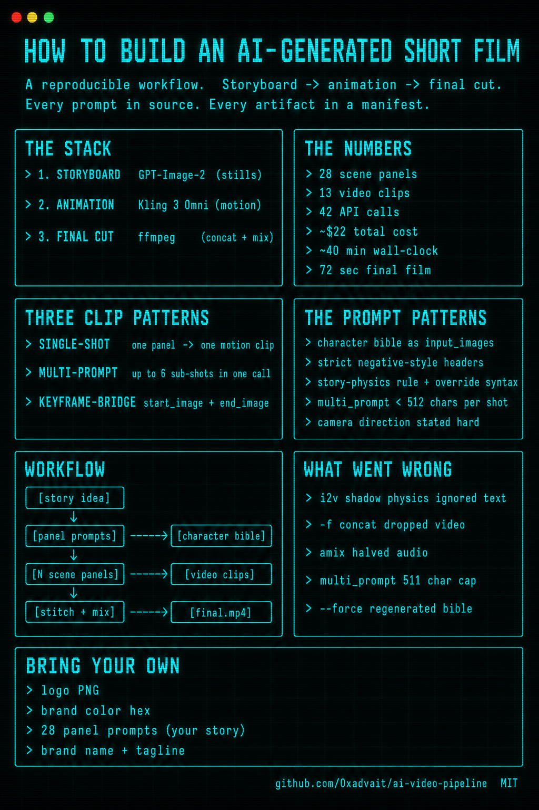
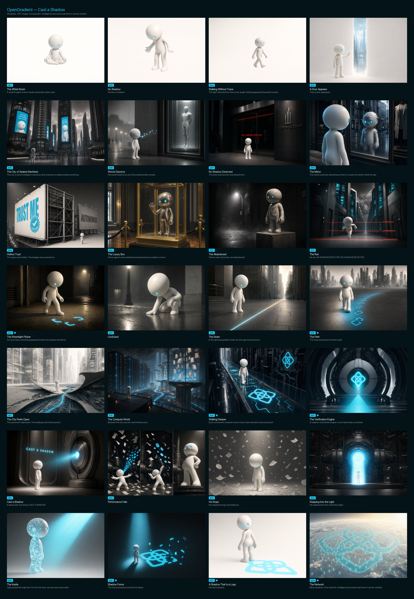
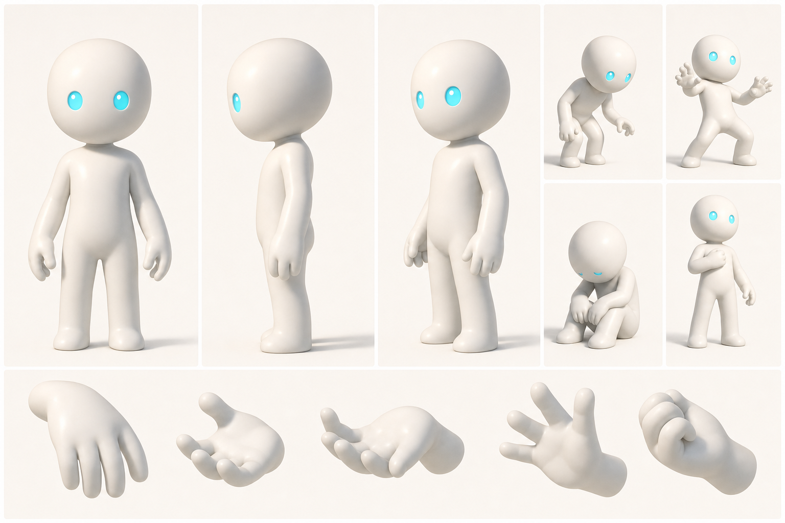

# AI Video Pipeline



**A reproducible workflow for AI-generated cinematic short films — storyboard → animation → mixed final cut.**

[](https://replicate.com/openai/gpt-image-2)
[](https://replicate.com/kwaivgi/kling-v3-omni-video)
[](https://replicate.com)

This repo is a **template** for producing 60–120 second cinematic shorts from a story idea. You write the story, the scripts handle the rest:

```
story idea → 28 panel-prompts → character bible (1 image) → 28 scene panels
                              → 13 clips (single-shot, multi-prompt, keyframe-bridge)
                              → ffmpeg concat + music bed
                              → final film
```

No hand-editing in DaVinci or Premiere. Every artifact is generated by a script, every prompt is in source, every API call is logged in a manifest.

The included worked example, *Cast a Shadow*, is a 72-second short film about an AI agent that has no shadow and walks across a dystopian-AI city until he discovers a verifiable network and casts one. The compiled storyboard below shows what the pipeline produces end-to-end.

> **The point of this repo is the workflow, not the example.** Cast a Shadow is one specific film. Replace the story, the brand, and the logo with yours and the same scripts produce *your* film. See [Bring Your Own Story](#bring-your-own-story).

---

## Contents

1. [The Stack](#the-stack)
2. [Bring Your Own Story](#bring-your-own-story)
3. [Worked Example: Cast a Shadow](#worked-example-cast-a-shadow)
4. [Workflow Architecture](#workflow-architecture)
5. [Three Clip Generation Patterns](#three-clip-generation-patterns)
6. [The Prompt Patterns That Worked](#the-prompt-patterns-that-worked)
7. [Final Film Assembly](#final-film-assembly)
8. [Reproduction Guide](#reproduction-guide)
9. [Cost Breakdown](#cost-breakdown)
10. [What Didn't Work (And What I Learned)](#what-didnt-work-and-what-i-learned)
11. [Repository Layout](#repository-layout)
12. [Credits & Models](#credits--models)

---

## The Stack

| Stage | Tool | What it produces |
|---|---|---|
| 1. Storyboard | `openai/gpt-image-2` via Replicate | 1 character reference sheet + N scene panels (3:2, 1764×1176) |
| 2. Animation | `kwaivgi/kling-v3-omni-video` via Replicate | Video clips (single-shot, multi-prompt, keyframe-bridge) |
| 3. Final cut | `ffmpeg` (filter_complex concat + amix) | Stitched + music-bed mixed final film |

Three things this stack gives you that hand-rolling doesn't:

- **Character consistency** via a single reference sheet passed as `input_images` to every panel — fixes identity drift completely.
- **Multi-prompt cost optimization** — Kling 3 Omni's `multi_prompt` lets you put up to 6 sub-shots in one API call, ~3× cheaper than firing 6 separate generations.
- **Keyframe bridging** — when motion needs to land on a specific framing, `start_image` + `end_image` interpolation produces a clip that's pinned to your storyboard.

---

## Bring Your Own Story

The pipeline takes 4 inputs that you customize. Everything else is plumbing.

| What | Where | Notes |
|---|---|---|
| **Logo PNG** | `assets/logos/Symbol_Cyan.png` | Drop your brand mark here. PNG with transparency, ≥512×512. The pipeline references this in panels that show the symbol. See `assets/logos/README.md` for specs. |
| **Brand color** | `BRAND_CYAN` constant in `scripts/generate_shadow_comic.py`, default `#24bce3` | The single saturated color in the film — everything else is desaturated greys + warm off-whites. Cinematic-discipline default. |
| **Story (28 panel prompts)** | `scripts/generate_shadow_comic.py` — `PANELS` list | The narrative. Edit these prompts to write your film. |
| **Brand name + tagline** | Search-replace `[Your Brand]` and `[Your tagline goes here]` across `scripts/` and `README.md` | These appear in some panel captions and in the README story summary. |

The architecture is story-agnostic. The Cast a Shadow story commits to one specific narrative spine (agent-without-shadow → discovers network → casts one), but the same scripts will produce a film about anything if you rewrite the panel prompts.

---

## Worked Example: Cast a Shadow

A 72-second AI-generated short film about verifiable intelligence, made with this pipeline as proof it works end-to-end.

**Story.** A small AI agent wakes in a white void and discovers he has no shadow. He walks through a city of sealed AI machines that refuse to recognize him, follows a glowing path beneath the pavement into a vast compute world, and stands before a verification engine. Light passes through him — computation made visible. A shadow forms — the brand symbol, complete and solid. Behind him, thousands of other agents appear, each casting the same shadow, connected into a network the size of a world.

> *"[Your tagline goes here]"*

### The 28-panel storyboard

The entire film was composed as a 28-panel comic book before any video was generated. Every shot exists as a still first, with character identity locked through a single reference sheet passed as `input_images` to every panel.



Reading order is left-to-right, top-to-bottom. The compiled storyboard PNG above (`assets/comic/shadow_comic.png`) is the strongest single artifact for understanding what the pipeline produces — every cut in the final film traces back to one of these 28 panels.

### The character bible

Identity consistency across all 28 panels comes from this single reference sheet (`assets/comic/agent_reference_sheet.png`):



This sheet was generated once by GPT-Image-2. Every scene panel passed it as the first entry in `input_images=[bible, logo]` so the agent's body, eye-points, and proportions stayed locked across all 28 stills.

### Final film stats

| Metric | Value |
|---|---|
| Duration | 72.1 seconds |
| Resolution | 1764 × 1176 (3:2 cinematic) |
| Frame rate | 24 fps |
| Audio | AAC stereo, native Kling Omni per-clip mixed under a Suno music bed |
| Total clips | 13 (8 single-shot + 3 multi-prompt + 2 keyframe-bridge) |
| Total panels | 28 stills (one per beat) |
| API calls | 1 character bible + 28 panels + ~16 video calls |
| Wall-clock total | ~40 minutes |
| **Cost** | **~$22 in Replicate credits** |

The final MP4 is not committed — regenerate it locally with the [reproduction guide](#reproduction-guide). Manifest receipts at `assets/comic/manifest_shadow_comic.json` and `assets/clips/manifest_shadow_transitions.json` are the audit trail (every prompt, every model version, every wall-clock timing).

---

## Workflow Architecture

```
                                                 ┌─────────────────────┐
                                                 │  Character bible    │
                                                 │  (GPT-Image-2)      │
                                                 └────────┬────────────┘
                                                          │ input_images
                                                          ▼
            ┌──────────────────────────────────────────────────────────────┐
            │  N scene panels (GPT-Image-2 with bible + brand-logo refs)  │
            └──────────┬───────────────────────────────────┬───────────────┘
                       │                                   │
                       │ start_image / end_image           │ reference_images
                       ▼                                   ▼
          ┌────────────────────────────┐    ┌──────────────────────────────┐
          │  Single-shot clips         │    │  Keyframe-bridge clips       │
          │  Kling 3 Omni single-image │    │  start_image=panel_N         │
          │  per panel                 │    │  end_image=panel_N+1         │
          └─────────────┬──────────────┘    └─────────────┬────────────────┘
                        │                                 │
          ┌─────────────────────────────┐                 │
          │  Multi-prompt clips         │                 │
          │  Kling 3 Omni multi_prompt  │                 │
          │  with up to 6 sub-shots     │                 │
          │  in one API call            │                 │
          └─────────────┬───────────────┘                 │
                        │                                 │
                        └──────────────┬──────────────────┘
                                       │
                                       ▼
                ┌──────────────────────────────────────────┐
                │  ffmpeg filter_complex concat            │
                │  + AAC music bed (amix, normalize=0)     │
                │  + 4-second fade in / out                │
                └──────────────────┬───────────────────────┘
                                   ▼
                              final.mp4
```

Every stage is fully scripted. No manual editing in DaVinci, Premiere, or After Effects.

---

## Three Clip Generation Patterns

| Pattern | When to use | Cost per call | Output | Cast-a-Shadow example |
|---|---|---|---|---|
| **Single-shot** | One panel, one continuous motion | ~$1.50 | One 5–8 sec clip from a single source frame | scene 5 (city establishing), scene 7 (door rejection) |
| **Multi-prompt** | Multiple short beats with coherent flow | ~$1.50 (one call, up to 6 shots) | One 6–9 sec clip with internal cuts and per-shot audio | shots 9/10/11 (affliction triptych: 3 × 2 sec) |
| **Keyframe-bridge** | Continuous motion between two specific panel framings | ~$1.50 | One clip that lands exactly on the end panel | bridge (3,4) (white void → portal materialize), bridge 27→28 (recognition → orbital reveal) |

**Multi-prompt is the cost unlock.** Three quick affliction beats as separate single-shot calls would be ~$4.50 for 6 sec of footage. One multi-prompt call delivers the same 6 sec of three quick cuts for ~$1.50, with native audio per sub-shot. The repo uses this for shots 9–11, 15–17, and 18–20 in the example.

---

## The Prompt Patterns That Worked

These are the patterns that survived production. They generalize beyond the example story.

### 1. Character bible passed as `input_images` to every panel

Earlier attempts that *only* used a text description ("small porcelain humanoid with cyan eye-points") drifted across panels — different proportions, different head shapes, different limb thicknesses. Adding the reference sheet as a literal image input fixes identity drift completely.

Bible prompt (from `scripts/generate_shadow_comic.py`):

```
Create a production character reference sheet for an original small AI-agent
character used in a feature-film CG short. Fixed visual identity: smooth matte
porcelain-white body the size of a small child (about one meter tall),
perfectly clean smooth surfaces, no clothing, no face except for two warm
cyan eye-points (exactly hex #24bce3) with single catch-lights, simple smooth
limbs, four-fingered rounded hands, slightly bulbous head, deliberately
ungendered and template-like.

Layout: full-body front view, full-body side profile, full-body three-quarter
view, four small expression studies (curious, alarmed, defeated, calm-resolve)
shown by posture and eye-glow alone, hand close-up. Plain off-white background,
editorial production-art reference sheet, clean and consistent across all
views, soft warm key light from upper-left.
```

### 2. Strict negative-style headers in every panel prompt

Without strict negatives, GPT-Image-2 drifts toward illustration, pastel, watercolor, or anime depending on scene content. Every panel prompt is prefixed with the same locked style header:

```
Cinematic semi-photoreal CG render, modern feature-film quality,
Pixar/DreamWorks/Apple-TV-Foundation visual register, dramatic single-source
key lighting, anamorphic 3:2 frame, deep cinematic negative space.
Color rule: ONLY one saturated color is allowed in the frame — brand color
exactly hex #24bce3. Everything else is desaturated greys, warm off-whites,
deep matte blacks. No teal, no aqua, no other blues.
Style negatives: NEVER line art, NEVER comic illustration, NEVER watercolor,
NEVER anime, NEVER hand-painted, NEVER pastel, NEVER Studio Ghibli register.
Feature-film 3D CG render only. No on-screen text or UI overlays unless the
panel explicitly calls for it.
```

### 3. Story-physics rules with explicit override syntax

The Cast a Shadow film has a central visual mechanic: the protagonist casts no shadow until the climax. Every panel prompt enforces this; only the override panels get a shadow. The mechanism that worked:

```
CRITICAL SHADOW RULE — APPLIES TO EVERY PANEL UNLESS THE PANEL BODY
EXPLICITLY OVERRIDES IT WITH 'SHADOW OVERRIDE': the small humanoid AI-agent
character casts NO shadow on any surface — no shadow on the floor beneath
his feet, no shadow on walls behind him, no contact shadow under his body,
no ambient occlusion shadow at his feet. The ground beneath him remains
perfectly clean and unmarked even when he is brightly lit. Light passes
him without leaving a trace. The ABSENCE of his cast shadow is the single
most important visual fact of every panel until the story explicitly
grants him one.
```

Override panels start with `SHADOW OVERRIDE:` to flip the rule for that specific panel. This pattern generalizes — for any film with an unusual physics constraint (no gravity, no aging, time runs backwards, etc.), state the rule in the global header and use a short override directive in scene prompts that need the rule flipped.

### 4. Multi-prompt requires <512 chars per shot

The Kling 3 Omni `multi_prompt` parameter takes a JSON array of `{prompt, duration}` shots, but each shot's prompt is **capped at 511 characters**. The first attempts at this failed at validation. The fix: move all common physics rules (style header, shadow rule, brand color rule) into the **top-level** `prompt` field, and keep each shot's `multi_prompt` entry tight and visually specific.

Working example from `scripts/generate_multi_15_16_17.py`:

```python
SHOT_15 = (
    "Use <<<image_1>>>: the small white humanoid AI agent walks forward "
    "along a thin glowing cyan seam stretching through a dim wet "
    "desaturated city street, his bare feet leaving no shadow on the "
    "pavement, the seam pulsing softly cyan as he steps over each "
    "section, slow patient stride."
)
```

The `<<<image_1>>>` syntax is Kling 3 Omni's prompt template reference — it maps onto entries in `reference_images`. This is how each multi-prompt sub-shot anchors to a specific source panel.

### 5. Camera direction needs explicit, hard phrasing

Soft phrasing like "viewed from behind" doesn't bind the camera. Kling regularly defaulted to front-facing or three-quarter shots even when the prompt asked for "from behind." The fix: explicit constraint plus a denial of the alternatives.

```
OVER-THE-SHOULDER REAR VIEW. Wide cinematic shot from STRICTLY BEHIND the
agent. The agent is shown ONLY as a back-silhouette in the lower-foreground
center: we see ONLY the back of his head and shoulders and back of his body
— NO face features, NO eye-glow visible from this angle, NO front of his
torso, NO front-facing arms.
```

This pattern generalizes: state the framing as a positive instruction *and* explicitly deny what you don't want.

---

## Final Film Assembly

The clips are concatenated by `scripts/stitch_cast_a_shadow.py` using ffmpeg's `filter_complex concat`. Two non-obvious bugs we hit and the fixes:

**1. Stream-order mismatch silently drops video.** When `ffmpeg -f concat` is given files where some have audio-stream-first and others have video-stream-first, the demuxer silently drops the video of mismatched files. We hit this when reversing one clip — the reversed clip had its streams swapped, and the concat output froze on the previous clip's last frame for 3 seconds where the missing scene should have been. **Fix:** switch from `-f concat` to `filter_complex concat`, which explicitly maps each input's `[i:v:0]` and `[i:a:0]` so stream order doesn't matter.

**2. `amix` defaults to dividing each input by N.** When mixing native per-clip Kling audio with a Suno music bed, the default `amix=inputs=2` halves both streams — which made the music bed inaudible even at full gain. **Fix:** `amix=inputs=2:normalize=0`. Each stream then plays at its own gain.

### Music bed behavior

The stitcher mixes a music bed (Suno, ElevenLabs, or any MP3 you provide) under the native Kling audio:

| Knob | Default | Notes |
|---|---|---|
| `--music-gain-db` | `-2` | dB offset on the bed before mix |
| `--fade-in` | `4.0` | seconds of fade-in at start |
| `--fade-out` | `4.0` | seconds of fade-out at end |
| `--music-start` | `0` | seconds into the source MP3 to start the window |
| `--no-music` | `False` | Skip the bed, output native audio only |

For some clips you may want silent native audio — Kling's auto-generated sound for that scene was wrong-mood (too musical, jarring, etc.). Replace the audio track with silence using `ffmpeg -i in.mp4 -f lavfi -i anullsrc=cl=stereo:r=44100 -map 0:v -map 1:a -shortest -c:v copy -c:a aac out.mp4` and the music bed will carry that segment cleanly.

---

## Reproduction Guide

### Prerequisites

- Python 3.11+
- `ffmpeg` with libx264 and AAC support (`brew install ffmpeg` on macOS)
- A Replicate API token (`https://replicate.com/account/api-tokens`)
- About **$30 in Replicate credits** for a clean full reproduction of the included example

### Setup

```bash
git clone https://github.com/0xadvait/ai-video-pipeline.git
cd ai-video-pipeline
python3 -m venv .venv && source .venv/bin/activate
pip install -r requirements.txt
export REPLICATE_API_TOKEN=r8_...

# Drop your brand logo PNG (see assets/logos/README.md for specs)
cp /path/to/your-brand.png assets/logos/Symbol_Cyan.png
```

### Run the full pipeline

```bash
# Stage 1 — character bible + 28 scene panels (~$3, ~10 min wall-clock)
python3 scripts/generate_shadow_comic.py --workers 6 --force

# Stage 1.5 — compile the storyboard PNG for review
python3 scripts/compile_shadow_comic.py

# Stage 2 — single-shot scenes + bridge clips (~$15, ~15 min wall-clock)
python3 scripts/generate_shadow_transitions.py --workers 2 \
  --video-model kwaivgi/kling-v3-omni-video --force

# Stage 2 — three multi-prompt clips (~$5, ~10 min wall-clock)
python3 scripts/generate_multi_9_10_11.py
python3 scripts/generate_multi_15_16_17.py
python3 scripts/generate_multi_18_19_20.py

# Stage 3 — stitch + mix
python3 scripts/stitch_cast_a_shadow.py --force
```

The Replicate API has a **6 RPM rate limit with burst of 1** for accounts under $5 in credit. The scripts include a 12-second submit gate to stay under this limit. Above $5 in credit the limit relaxes; you can raise `--workers` for faster wall-clock.

### Re-stitch only (no API spend)

If you just want to remix existing clips with a different music bed:

```bash
# Drop your music file at assets/audio/music_bed.mp3
python3 scripts/stitch_cast_a_shadow.py --force --music-gain-db -3 --fade-in 6
```

### Regenerate a single panel or clip

```bash
# panel
rm assets/comic/panels/panel_07_no_shadow_detected.png
python3 scripts/generate_shadow_comic.py --only 7

# video clip
rm assets/clips/scene_07.mp4
python3 scripts/generate_shadow_transitions.py --only 7 \
  --video-model kwaivgi/kling-v3-omni-video
```

---

## Cost Breakdown

| Stage | API calls | Cost (Pro mode 1080p) | Wall-clock |
|---|---|---|---|
| Character bible | 1 | ~$0.10 | ~2 min |
| 28 scene panels | 28 | ~$2.80 | ~10 min @ 6 workers |
| 8 single-shot clips | 8 | ~$12 | ~12 min @ 2 workers |
| 2 keyframe-bridge clips | 2 | ~$3 | ~5 min |
| 3 multi-prompt clips | 3 | ~$4.50 (one call per group of 3 sub-shots) | ~7 min |
| Final stitch + mix | 0 (ffmpeg local) | $0 | ~30 sec |
| **Total** | **42 API calls** | **~$22** | **~40 min** |

Adding rate-limit headroom and the inevitable retry-after-prompt-tweaks budget brings real-world cost to **~$30** for a full clean reproduction.

---

## What Didn't Work (And What I Learned)

| Attempt | Outcome | Lesson |
|---|---|---|
| Seedance 2.0 i2v with strong "no shadow" text prompts | Failed — i2v models inherit shadow physics from training data; text alone doesn't bind hard enough | Switched to Kling 3 Omni which has stronger text-conditioning |
| Reversing video AND audio for a clip | Worked visually but audio was a backwards denial-buzz which sounded weird | Reverse video only; replace audio with silence and let the music bed carry the segment |
| `amix=inputs=2` default normalize | Made music inaudible (each input divided by N=2 + my -8dB gain) | Always use `amix=normalize=0` when you've already balanced gains manually |
| `-f concat` demuxer with mixed stream orders | Silently dropped video on the mismatched clip | Use `filter_complex concat` with explicit `[i:v:0][i:a:0]` mapping |
| Multi-prompt with verbose shot prompts | Validation failure: `shot N prompt is 584 chars (max 511)` | Move common physics rules to the top-level prompt; keep each shot's `multi_prompt` entry tight and visual |
| Generating the agent forward-facing in journey shots | The agent looked like he was confronting the camera; killed the journey-into-the-world feel | Explicit "from behind, no face features visible" instruction in the panel prompt |
| `--force` on a partial regen | Quietly re-runs the character bible too (it's cached but `--force` bypasses) | For surgical regens: `rm` the file then run `--only N` without `--force` |
| End-frame pinning for a shadow-assembling clip | The reference panel showed flying fragments at the final frame, so Kling played it as fragments scattering outward | Regenerate the end panel as a fully-resolved final state, then re-bridge |

---

## Repository Layout

```
ai-video-pipeline/
├── README.md                     # this file
├── LICENSE                       # MIT
├── requirements.txt              # replicate, Pillow
├── .gitignore                    # ignores generated panels/clips/finals
├── scripts/
│   ├── replicate_helpers.py      # shared Replicate plumbing (run, schema, manifests, rate-limit)
│   ├── generate_shadow_comic.py  # bible + N panels (GPT-Image-2)
│   ├── compile_shadow_comic.py   # builds the N-panel storyboard PNG (Pillow)
│   ├── generate_shadow_transitions.py  # single-shot + keyframe-bridge clips (Kling 3 Omni)
│   ├── generate_multi_9_10_11.py    # multi-prompt — affliction triptych (example)
│   ├── generate_multi_15_16_17.py   # multi-prompt — continuous walk (example)
│   ├── generate_multi_18_19_20.py   # multi-prompt — compute world arc (example)
│   └── stitch_cast_a_shadow.py   # filter_complex concat + amix music bed (ffmpeg)
└── assets/
    ├── logos/                    # drop your brand mark here as Symbol_Cyan.png
    ├── audio/                    # drop your music bed here as music_bed.mp3 (gitignored)
    ├── comic/
    │   ├── agent_reference_sheet.png    # the example character bible (proof-of-output)
    │   ├── shadow_comic.png             # compiled 28-panel storyboard (proof-of-output)
    │   ├── manifest_shadow_comic.json   # per-panel generation receipts
    │   └── panels/                       # gitignored — regenerate via scripts
    └── clips/
        └── manifest_shadow_transitions.json  # per-clip generation receipts (gitignored mp4s)
```

The two manifest JSONs are transparent receipts of what was generated when, with what prompt, what model version, what input references, and what wall-clock latency. They're the audit trail for the included example. **Generated panel PNGs and video clips are not committed** — they regenerate from the scripts and are gitignored to keep the repo lightweight.

---

## Credits & Models

| Component | Provider | Model |
|---|---|---|
| Character bible + scene panels | OpenAI (via Replicate) | `openai/gpt-image-2` |
| Video animation | Kuaishou (via Replicate) | `kwaivgi/kling-v3-omni-video` (Kling 3.0 Omni Pro mode, 1080p) |
| Storyboard composition | Pillow | `PIL.Image` (no API spend) |
| Final concat + audio mix | FFmpeg | `filter_complex concat` + `amix normalize=0` (no API spend) |
| Music bed | Bring your own | Suno, ElevenLabs, or any MP3 |

Cinematic references that informed the example's prompt vocabulary: *Foundation* (Apple TV+) for cathedral compute architecture, *Blade Runner 2049* for the dystopian-AI-city palette, Pixar's character ranges for the agent silhouette discipline. The example commits to one saturated color (`#24bce3`) and treats every other element as a desaturated grey-and-warm-off-white field. Edit `BRAND_CYAN` in `generate_shadow_comic.py` to make the same workflow produce a film in your brand's color.
